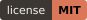
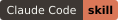

<div align="center">


# `/all-deploy`

**Takes any website, app, API or agent from "it runs on my laptop" to "it's live on the internet" — and refuses to skip the safety audit on the way.**

[](https://github.com/Hainrixz/all-deploy/actions/workflows/ci.yml)
[](LICENSE)
[](https://claude.com/claude-code)

🌐 [tododeia.com](https://tododeia.com) · 📸 [@soyenriquerocha](https://instagram.com/soyenriquerocha) · 📦 [Latest release](https://github.com/Hainrixz/all-deploy/releases/latest)

**[English](#english)  ·  [Español](#español)**

</div>

---

<div align="center">
<table>
<tr>
<td width="25%" align="center"></td>
<td width="25%" align="center"></td>
<td width="25%" align="center"></td>
<td width="25%" align="center"></td>
</tr>
<tr>
<td align="center"><b>1 · Detect</b><br><sub>Reads your project<br><i>Lee tu proyecto</i></sub></td>
<td align="center"><b>2 · Audit</b><br><sub>Blocks on secrets<br><i>Frena ante secretos</i></sub></td>
<td align="center"><b>3 · Deploy</b><br><sub>Preview before prod<br><i>Preview antes de prod</i></sub></td>
<td align="center"><b>4 · Roll back</b><br><sub>Always an exit<br><i>Siempre hay salida</i></sub></td>
</tr>
</table>
</div>

---

## English

### The problem

Deploying is rarely hard because the commands are hard. It's hard because the commands are *different every time*, and because the expensive mistakes — a committed `.env`, a service bound to `127.0.0.1`, a production push that was never checked — happen in the gap between "it works locally" and "it's live."

`/all-deploy` closes that gap. It reads your project, blocks on the things that actually break deploys, picks the host that fits, and only promotes to production after a preview URL has answered with a real HTTP status.

**And it covers plain web pages, not just apps.** If you have a folder with `index.html` in it and no idea where to put it, that's a first-class path: no git repo required, four free hosts with their real limits and licence terms laid out, and a set of checks aimed squarely at the things that break a page *after* it goes live. There's also a [companion skill](cowork-plugin/) for that case with no terminal at all.

### What it does

One command inside Claude Code walks the same path, phases 0 through 6, every time:

| Phase | What happens |
|---|---|
| **0 · Class + prerequisites** | Decides first whether this is an **app** or a **static site** — a folder of HTML is neither Node nor Python, and used to get bounced for it. Apps need a git repo and a remote; a static site needs neither. |
| **1 · Detect** | Fingerprints your framework, runtime version, start command, port binding, database dependencies, and any existing deploy config. |
| **2 · Audit** | Runs a deterministic script over the project. Any *critical* finding halts the run — including in full-auto mode. Warnings print but don't block. |
| **3 · Target** | Ranks the hosts that fit your project shape and explains why. You pick, or accept the top choice. |
| **3.5 · CLI check** | Verifies the chosen target's CLI is installed *and* authenticated. If not, it stops and hands you the command — `! vercel login` — then resumes here when you're done. |
| **4 · Preview** | Delivers your env vars to the target, then deploys to preview/staging. Never `--prod` on this pass. |
| **4.5 · Health check** | `curl`s the preview URL. A 2xx or 3xx promotes. Anything else — including a connection failure — stops the run and prints the log command. |
| **5 · Production** | Prints a summary, then promotes. Full-auto gives you a real 5-second ESC window; step-by-step requires an explicit "yes". |
| **6 · Handover** | Verifies prod, confirms env vars landed, and hands you the rollback and log-tail commands for your specific target. |

### Install (30 seconds)

```bash
git clone https://github.com/Hainrixz/all-deploy.git ~/.claude/skills/all-deploy
```

That's it — `/all-deploy` now works inside Claude Code. To update later:

```bash
cd ~/.claude/skills/all-deploy && git pull
```

Prefer a single file? Download `all-deploy.skill` from the [Releases page](https://github.com/Hainrixz/all-deploy/releases/latest) and use Claude Code's skill installer.

> **First run tip.** The skill will point you at the `fewer-permission-prompts` skill. Running it once on your project seeds an allowlist so you're not approving every individual deploy command.

### Usage

| You say | What happens |
|---|---|
| `/all-deploy` | Starts a deploy. Asks whether you want full-auto or step-by-step. |
| `/all-deploy auto` | Full-auto. Audit → preview → prod, with a 5-second ESC window before prod. |
| `/all-deploy step` | Step-by-step. Stops for your OK between audit, preview, and prod. Saying `step by step` or `paso a paso` up front does the same. |
| `/all-deploy local` | Runs the app on your machine instead of deploying it. |
| `publish my website` · `sube mi página web` | Static-site path: checks the page, compares the free hosts, publishes it. Works with no git repo. |
| `deploy this` · `ship this` · `push to prod` · `get this online` | Natural language triggers the skill too. |

Spanish phrasing works as well — `/despliega`, `despliega esto`, `ponlo online`, or `corre esto localmente` for local mode.

### What the audit actually checks

This is the part that makes the skill worth using. Findings come in two severities, and the distinction is real: **criticals stop the deploy**, warnings are printed for you to judge.

**Critical — the deploy does not continue:**

- **Secrets in tracked files** — a committed `.env`, or an API key, token, or credential matching a known provider pattern in a file git is already following.
- **No `.gitignore`** — the file is missing entirely.
- **Missing Node lockfile** — `package.json` with no `package-lock.json` / `pnpm-lock.yaml` / `yarn.lock` / `bun.lockb`.
- **`.env.example` missing or incomplete** — every env var your source actually reads must be documented. A companion script scans your code to build the expected list, so the file can't quietly drift out of date.
- **Dirty working tree** — uncommitted tracked changes make a rollback ambiguous. Waivable via `ALLOW_DIRTY_TREE`.
- **No git remote configured** — skipped for the Docker+VPS flow, which doesn't need one.
- **Dependency vulnerabilities** — critical advisories from `npm audit --production --audit-level=high`, or *any* vulnerable package reported by `pip-audit`.

**Warning — printed, but the run continues:**

- **`.gitignore` incomplete** — it exists but doesn't cover all the expected entries.
- **No Python lockfile** — `uv.lock`, `poetry.lock`, or `Pipfile.lock`. A pinned `requirements.txt` counts instead.
- **No start command** detected for the host to run.
- **Runtime version not pinned** — no `.nvmrc`, `.node-version`, `engines`, `.python-version`, or `requires-python`. Worth fixing before a long-running target, where an unpinned runtime drifts under you.
- **Localhost-only binding** — the service appears to bind `127.0.0.1`, which most hosts can't route to. This one deploys "successfully" and then serves nothing, so read it carefully even though it doesn't block.
- **High (non-critical) npm vulnerabilities**, and **untracked files**.

When a check fails, you get the fix as a diff first and approve it before anything is written.

**For a static site, a different set of checks runs** — because most of the ones above are meaningless for a folder of HTML, and two of them used to fire as *false* criticals and block the deploy outright. What runs instead:

- **The home page is named `index.html`** — hosts serve that name at `/`, so `mi-pagina.html` 404s at the site root. Critical.
- **Filename capitalisation.** `` when the file is `Imagenes/Foto.PNG` loads on your Mac — its filesystem ignores capitals — and 404s on every host, which run Linux. The images vanish and nothing in any log explains why. Critical, and the reason this check exists: it resolves every reference against a case-folded index of the real filenames rather than calling `Path.exists()`, which on macOS returns `True` for the wrong spelling and would make the check silently useless for exactly the people who need it.
- **Paths pointing at your own computer** — `file:///Users/...`, `C:\Users\...`. Critical.
- **A `.env` inside the folder being uploaded** — it would be downloadable at `/.env` the moment the site is live. Critical.
- **Credentials in served files.** A private repo doesn't help; a static host serves what you give it. Publishable keys (Stripe `pk_`, referrer-restricted Google Maps) are *designed* to be public and only warn — blocking those would train you to ignore the audit.
- **`.nojekyll`** when the target is GitHub Pages and a folder starts with `_`, which otherwise makes every stylesheet silently 404.
- **Warnings:** broken references, oversized images, total site size, and a missing `<title>` / description / Open Graph block — without which sharing the link on WhatsApp shows a blank card that reads as broken.

**Git history is scanned separately, by you.** The skill surfaces the command — `trufflehog git file://.` — rather than running it silently, and it never rewrites your history. Removing a secret from past commits is a decision with consequences for everyone who cloned the repo; it isn't something a deploy tool should do on your behalf.

### What it detects

| Signal | Read from |
|---|---|
| Package manager | `package.json`, `pnpm-lock.yaml`, `yarn.lock`, `package-lock.json`, `bun.lockb`, `pyproject.toml`, `requirements.txt`, `poetry.lock`, `uv.lock`, `Pipfile` |
| Framework | `next.config.*`, `vite.config.*`, `astro.config.*`, `remix.config.*`, `nuxt.config.*`, `svelte.config.*`, `app/` vs `pages/`, `FastAPI()` / `Flask()` in `main.py`, `server.py`, root `index.html` |
| Runtime version | `.nvmrc`, `.node-version`, `engines`, `.python-version` |
| Stateful deps | imports of `sqlalchemy`, `psycopg`, `prisma`, `mongoose`, `redis`, `ioredis`, `sqlmodel` — surfaces "provision a database before prod" |
| Existing config | `vercel.json`, `railway.toml`, `fly.toml`, `Dockerfile`, `render.yaml` — respected and audited, never silently regenerated |
| Existing linkage | `.vercel/project.json`, `railway.toml` project field — re-deploys to the same project rather than creating a new one |

For a static site it detects the one field that matters most: the **publish directory**, the folder that actually holds `index.html` — `.` for a plain page, `dist/` for Astro or Vite, `public/` for Hugo, `_site/` for Jekyll or Eleventy, `site/` for MkDocs, `build/` for Docusaurus, `out/` for a Next export. Getting this wrong is the most common cause of a site that deploys "successfully" and 404s at `/`.

Two cases where it stops and asks instead of guessing:

- **Monorepos** (`pnpm-workspace.yaml`, `turbo.json`, `nx.json`, `lerna.json`, `workspaces`) — it enumerates the packages and asks which one you mean.
- **Libraries and CLIs** — if the project looks like a package rather than a service, it exits cleanly. `/all-deploy` targets web services, not npm or PyPI publishes.

### Supported targets (v1)

| Target | Best for | Rollback story |
|---|---|---|
| **Cloudflare Pages** | Static sites — the default pick when anyone is being paid | Dashboard only; there is no CLI rollback and the skill says so |
| **Netlify** | Static sites needing a contact form; drag-and-drop | Publish a previous deploy from the dashboard, instantly |
| **GitHub Pages** | Portfolios, docs, demos already on GitHub | `git revert` and push |
| **Render** | Static sites with low traffic | Dashboard, last two deploys only |
| **Vercel** | Next.js, Vite, Astro, Remix, Nuxt, SvelteKit, static sites | `vercel rollback` |
| **Railway** | FastAPI, Flask, Express, Python workers, agent loops, MCP HTTP servers | Redeploy a prior commit — Railway has no first-class rollback, and the skill says so instead of pretending |
| **Docker + SSH VPS** | Self-hosted, stateful apps, multi-service `docker compose` stacks | Re-tag and restart the prior image |
| **cloudflared tunnel** | Local dev exposure, quick demos, webhook testing | Stop the tunnel |

#### The free-hosting question nobody asks

Before ranking static hosts, the skill asks one thing: **is anyone being paid in connection with this page?**

It matters more than any technical comparison, because two of the five free plans restrict commercial use and one defines it far more broadly than people expect. Vercel's Fair Use Guidelines count *"receiving payment to create, update, or host the site"* as commercial usage — so a client's brochure page is out even if it sells nothing, carries no ads and takes no payments. GitHub Pages bars sites *"primarily directed at facilitating commercial transactions."* Cloudflare Pages, Netlify and Render have no such restriction.

Two more things worth knowing before you pick, both in [`references/static-hosting.md`](references/static-hosting.md) with the quoted terms: Netlify's free plan is a **300-credit monthly budget** — a production deploy costs 15, and when it runs out the site is *paused* with a "Site not available" page — and Render's free static bandwidth is now **5 GB/month**, down from 100 GB.

The hosting is free on all five. **The domain never is** — around $10–15/year, and none of them include one. [`references/custom-domain.md`](references/custom-domain.md) has the DNS records per host.

More targets (Fly, Modal, Hugging Face Spaces) — [open an issue](https://github.com/Hainrixz/all-deploy/issues) to vote for yours.

### Run it locally instead

<table>
<tr>
<td width="58%" valign="top">

`/all-deploy local` runs the same discipline without touching a host.

It runs a **scoped audit** — exactly three checks: secrets in tracked files, a start command exists, and sane port binding. Everything else is skipped, because there's no remote to deploy to and no production to protect.

Then it starts your app with the detected command and streams the output.

If you want a temporary public URL for a demo or a webhook test, it can chain into a cloudflared tunnel from there.

</td>
<td width="42%" valign="top">

</td>
</tr>
</table>

### Safety — the 8 hard rules

These are the skill's contract with you. It doesn't negotiate on them.

1. **Never bypass or soften the audit.** In full-auto mode the audit is the only gate between your intent and live infrastructure. A check that *can't run* counts as a failure, not as permission to continue.
2. **Never deploy to prod without a green preview** in the same session, confirmed by a real HTTP status.
3. **Never print, log, or commit secrets.** Keys are confirmed by name; values never appear in summaries, logs, or commit messages.
4. **Never auto-install or auto-authenticate a CLI.** You get handed `! vercel login` — you run it. A deploy tool should not be able to log itself into your accounts.
5. **Never hide deploy commands in wrapper scripts.** Every command is one you can read, copy, and run yourself.
6. **Never modify your code without showing the diff first.** That includes `.gitignore` edits, Dockerfile scaffolding, and port-binding fixes.
7. **Never deploy from a dirty working tree** unless you explicitly allow it.
8. **"Wait" always wins.** Any hesitation between preview and prod — *wait*, *hold*, *stop*, *not yet* — aborts the promotion cleanly.

Full rules and the complete workflow live in [SKILL.md](SKILL.md).

### Configuration

Three settings at the top of `SKILL.md` change the default behavior:

```
CONFIRMATION_MODE: ask_at_start   # ask_at_start · full_auto · always_ask
VISUAL_VERIFY: false              # true → screenshot the preview (frontends only)
ALLOW_DIRTY_TREE: false           # true → skip the clean-HEAD audit check
```

`ask_at_start` is the default and the right choice for almost everyone: the mode decision moves to runtime, so you choose per deploy. Pinning `full_auto` or `always_ask` is mainly useful when wrapping the skill in automation that can't answer an interactive question.

### Requirements

- **macOS or Linux.** On Windows, install under WSL2.
- **Git** and **Python 3.8+**.
- **The CLI for your chosen target** — Vercel, Railway, Wrangler, Netlify, `gh`, `cloudflared`, or SSH + Docker. The skill tells you exactly which one is missing and how to install it, then waits.
- **For a static site, no CLI at all is required.** Every static target except Render has a complete browser route, and the skill offers it by default when the CLI isn't installed.
- **Claude Code** — CLI, desktop, web, or an IDE extension.

### What it deliberately doesn't do

Being clear about the edges is part of the safety story:

- **No Go, Rust, Ruby, Elixir, Bun, or Deno in v1.** It exits and points you at the target CLI rather than guessing at an ecosystem it can't fingerprint.
- **No git history rewriting**, ever — it surfaces the scan command instead.
- **No npm or PyPI publishing.** It deploys services, not packages.
- **No CLI installs or logins on your behalf.**
- **No hidden magic.** Every reference file documents real, copy-pasteable commands.

### What's in this repo

```
SKILL.md                    The skill itself — rules, phases, workflow
scripts/audit.py            The deterministic pre-deploy audit
scripts/env_extract.py      Scans source for env-var usage
scripts/static_check.py     The static-site checks; runs standalone too
references/
  project-types.md          Framework fingerprint table
  audit-checklist.md        Every audit rule, with fix guidance
  env-mapping.md            How env vars move to each target
  agents.md                 Adjustments for four agent shapes
  static-sites.md           The static project class and its phase changes
  static-hosting.md         Five free hosts compared, incl. commercial terms
  custom-domain.md          DNS records per host, apex vs www
  targets/*.md              One playbook per target
cowork-plugin/              publish-website — the no-terminal companion skill
assets/templates/           Dockerfiles, compose and .env.example templates
tests/                      35-test suite, run on every push to main and every PR
```

### Contributing

Issues and pull requests are welcome. Good first contributions:

- **Add a target** under `references/targets/` — Fly, Modal, Hugging Face Spaces, Deno Deploy, Surge.
- **Extend the audit** — new secret patterns or checks in `scripts/audit.py`.
- **Improve detection** in `references/project-types.md`.

Keep reference files under ~200 lines and follow the existing shape: prereqs → env delivery → preview → health check → prod → rollback + logs. See [CONTRIBUTING.md](CONTRIBUTING.md) for the full guide.

### License

MIT — see [LICENSE](LICENSE). Use it, fork it, ship it commercially. Just keep the copyright notice.

---

## Español

### El problema

Desplegar casi nunca es difícil por los comandos. Es difícil porque los comandos *cambian cada vez*, y porque los errores caros — un `.env` commiteado, un servicio escuchando en `127.0.0.1`, un push a producción que nadie verificó — pasan justo en el hueco entre *"funciona en mi máquina"* y *"está en vivo"*.

`/all-deploy` cierra ese hueco. Lee tu proyecto, frena ante lo que de verdad rompe despliegues, elige el host que encaja, y solo promueve a producción después de que una URL de preview haya respondido con un status HTTP real.

**Y también sirve para páginas web, no solo para apps.** Si tienes una carpeta con `index.html` y no sabes dónde subirla, ese es un camino de primera clase: no hace falta repo de git, trae cuatro hosts gratis con sus límites y sus términos de licencia reales, y un conjunto de revisiones apuntadas justo a lo que rompe una página *después* de publicarla. Hay además una [skill compañera](cowork-plugin/) para ese caso, sin terminal.

### Qué hace

Un solo comando dentro de Claude Code recorre el mismo camino, de la fase 0 a la 6, siempre:

| Fase | Qué pasa |
|---|---|
| **0 · Clase + prerrequisitos** | Primero decide si esto es una **app** o una **página estática** — una carpeta de HTML no es Node ni Python, y antes la rebotaba por eso. Las apps necesitan repo y remote; una página estática no necesita ninguno de los dos. |
| **1 · Detecta** | Identifica tu framework, versión de runtime, comando de arranque, binding de puerto, dependencias de base de datos y cualquier config de deploy existente. |
| **2 · Audita** | Corre un script determinista sobre el proyecto. Cualquier hallazgo *crítico* detiene la corrida — también en modo automático. Las advertencias se imprimen pero no bloquean. |
| **3 · Target** | Ordena los hosts que encajan con tu proyecto y explica por qué. Eliges tú, o aceptas el primero. |
| **3.5 · Revisión del CLI** | Verifica que el CLI del target elegido esté instalado *y* autenticado. Si no, se detiene y te entrega el comando — `! vercel login` — y retoma aquí cuando termines. |
| **4 · Preview** | Entrega tus variables de entorno al target y despliega a preview/staging. Nunca `--prod` en este paso. |
| **4.5 · Health check** | Hace `curl` a la URL de preview. Un 2xx o 3xx promueve. Cualquier otra cosa — incluyendo un fallo de conexión — detiene todo y te imprime el comando de logs. |
| **5 · Producción** | Imprime un resumen y promueve. En automático tienes una ventana real de 5 segundos para ESC; en paso a paso hace falta un "sí" explícito. |
| **6 · Entrega** | Verifica prod, confirma que las variables llegaron, y te deja los comandos de rollback y de logs para tu target específico. |

### Instalación (30 segundos)

```bash
git clone https://github.com/Hainrixz/all-deploy.git ~/.claude/skills/all-deploy
```

Listo — `/all-deploy` ya funciona dentro de Claude Code. Para actualizar después:

```bash
cd ~/.claude/skills/all-deploy && git pull
```

¿Prefieres un solo archivo? Descarga `all-deploy.skill` desde la [página de Releases](https://github.com/Hainrixz/all-deploy/releases/latest) y úsalo con el instalador de skills de Claude Code.

> **Tip para la primera corrida.** El skill te va a señalar el skill `fewer-permission-prompts`. Correrlo una vez sobre tu proyecto deja preparada una allowlist para que no tengas que aprobar cada comando de deploy uno por uno.

### Uso

| Tú dices | Qué pasa |
|---|---|
| `/all-deploy` | Inicia el deploy. Pregunta si quieres automático o paso a paso. |
| `/all-deploy auto` | Automático. Audit → preview → prod, con 5 segundos para cancelar con ESC antes de prod. |
| `/all-deploy step` | Paso a paso. Se detiene por tu OK entre audit, preview y prod. Decir `paso a paso` desde el inicio hace lo mismo. |
| `/all-deploy local` | Corre la app en tu máquina en vez de desplegarla. |
| `sube mi página web` · `publica mi página` | Camino de página estática: revisa la página, compara los hosts gratis y la publica. Funciona sin repo de git. |
| `/despliega` · `despliega esto` · `ponlo online` · `corre esto localmente` | El lenguaje natural también dispara el skill. |

El inglés también funciona — `deploy this`, `ship this`, `push to prod`, `get this online`.

### Qué revisa el audit en realidad

Esta es la parte que hace que el skill valga la pena. Los hallazgos vienen en dos severidades, y la diferencia es real: **los críticos detienen el deploy**, las advertencias se imprimen para que tú juzgues.

**Crítico — el deploy no continúa:**

- **Secretos en archivos trackeados** — un `.env` commiteado, o una API key, token o credencial que coincida con el patrón de algún proveedor conocido, en un archivo que git ya sigue.
- **No hay `.gitignore`** — el archivo falta por completo.
- **Falta el lockfile de Node** — hay `package.json` pero no `package-lock.json` / `pnpm-lock.yaml` / `yarn.lock` / `bun.lockb`.
- **`.env.example` ausente o incompleto** — cada variable que tu código realmente lee tiene que estar documentada. Un script acompañante escanea tu código para construir la lista esperada, así que el archivo no se desincroniza en silencio.
- **Working tree sucio** — los cambios trackeados sin commitear vuelven ambiguo el rollback. Se puede eximir con `ALLOW_DIRTY_TREE`.
- **No hay remote de git configurado** — se omite en el flujo de Docker+VPS, que no necesita uno.
- **Vulnerabilidades en dependencias** — advisories críticos de `npm audit --production --audit-level=high`, o *cualquier* paquete vulnerable que reporte `pip-audit`.

**Advertencia — se imprime, pero la corrida sigue:**

- **`.gitignore` incompleto** — existe pero no cubre todas las entradas esperadas.
- **Falta el lockfile de Python** — `uv.lock`, `poetry.lock` o `Pipfile.lock`. Un `requirements.txt` con versiones fijadas cuenta igual.
- **No se detectó comando de arranque** para que lo corra el host.
- **Versión de runtime sin fijar** — no hay `.nvmrc`, `.node-version`, `engines`, `.python-version` ni `requires-python`. Vale la pena arreglarlo antes de un target de larga duración, donde un runtime sin fijar se te mueve solo.
- **Binding solo a localhost** — el servicio parece escuchar en `127.0.0.1`, a donde la mayoría de los hosts no puede rutear. Esta despliega "exitosamente" y luego no sirve nada, así que léela con cuidado aunque no bloquee.
- **Vulnerabilidades npm altas (no críticas)** y **archivos sin trackear**.

Cuando algo falla, primero ves el arreglo como diff y lo apruebas antes de que se escriba nada.

**Para una página estática corre otro conjunto de revisiones** — porque casi todas las de arriba no significan nada para una carpeta de HTML, y dos de ellas disparaban como críticos *falsos* y bloqueaban el deploy. Lo que corre en su lugar:

- **Que la página principal se llame `index.html`** — los hosts sirven ese nombre en `/`, así que `mi-pagina.html` da 404 en la raíz del sitio. Crítico.
- **Mayúsculas en los nombres de archivo.** `` cuando el archivo es `Imagenes/Foto.PNG` carga en tu Mac —su sistema de archivos ignora mayúsculas— y da 404 en cualquier host, porque todos corren Linux. Las imágenes desaparecen y ningún log explica por qué. Crítico, y la razón de que este check exista: resuelve cada referencia contra un índice de los nombres reales en disco, no con `Path.exists()`, que en macOS devuelve `True` con la ortografía equivocada y dejaría el check inútil justo para quien lo necesita.
- **Rutas que apuntan a tu propia computadora** — `file:///Users/...`, `C:\Users\...`. Crítico.
- **Un `.env` dentro de la carpeta que vas a subir** — quedaría descargable en `/.env` apenas el sitio esté en vivo. Crítico.
- **Credenciales en archivos que se sirven.** Que el repo sea privado no ayuda: un host estático sirve lo que le des. Las llaves publicables (Stripe `pk_`, Google Maps con restricción de referrer) están *diseñadas* para ser públicas y solo avisan — bloquearlas te enseñaría a ignorar el audit.
- **`.nojekyll`** cuando el target es GitHub Pages y hay una carpeta que empieza con `_`, que si no hace que cada hoja de estilos dé 404 en silencio.
- **Avisos:** referencias rotas, imágenes pesadas, tamaño total del sitio, y que falte el `<title>` / descripción / Open Graph — sin eso, compartir el link por WhatsApp muestra una tarjeta en blanco que se ve rota.

**El historial de git lo escaneas tú, aparte.** El skill te muestra el comando — `trufflehog git file://.` — en vez de correrlo en silencio, y nunca reescribe tu historial. Sacar un secreto de commits pasados es una decisión con consecuencias para todo el que haya clonado el repo; no es algo que una herramienta de deploy deba hacer por ti.

### Qué detecta

| Señal | De dónde la lee |
|---|---|
| Gestor de paquetes | `package.json`, `pnpm-lock.yaml`, `yarn.lock`, `package-lock.json`, `bun.lockb`, `pyproject.toml`, `requirements.txt`, `poetry.lock`, `uv.lock`, `Pipfile` |
| Framework | `next.config.*`, `vite.config.*`, `astro.config.*`, `remix.config.*`, `nuxt.config.*`, `svelte.config.*`, `app/` vs `pages/`, `FastAPI()` / `Flask()` en `main.py`, `server.py`, `index.html` en la raíz |
| Versión de runtime | `.nvmrc`, `.node-version`, `engines`, `.python-version` |
| Dependencias con estado | imports de `sqlalchemy`, `psycopg`, `prisma`, `mongoose`, `redis`, `ioredis`, `sqlmodel` — avisa "provisiona una base de datos antes de prod" |
| Config existente | `vercel.json`, `railway.toml`, `fly.toml`, `Dockerfile`, `render.yaml` — se respetan y auditan, nunca se regeneran en silencio |
| Proyecto ya vinculado | `.vercel/project.json`, campo `project` en `railway.toml` — re-despliega al mismo proyecto en vez de crear uno nuevo |

Para una página estática detecta el campo que más importa: el **directorio de publicación**, la carpeta que realmente contiene `index.html` — `.` para una página plana, `dist/` para Astro o Vite, `public/` para Hugo, `_site/` para Jekyll o Eleventy, `site/` para MkDocs, `build/` para Docusaurus, `out/` para un export de Next. Equivocarlo es la causa más común de un sitio que despliega "bien" y da 404 en `/`.

Dos casos donde se detiene y pregunta en vez de adivinar:

- **Monorepos** (`pnpm-workspace.yaml`, `turbo.json`, `nx.json`, `lerna.json`, `workspaces`) — enumera los paquetes y te pregunta cuál.
- **Librerías y CLIs** — si el proyecto parece un paquete y no un servicio, sale limpio. `/all-deploy` despliega servicios web, no publica en npm ni PyPI.

### Targets soportados (v1)

| Target | Ideal para | Cómo se revierte |
|---|---|---|
| **Cloudflare Pages** | Páginas estáticas — la opción por defecto cuando a alguien le están pagando | Solo dashboard; no hay rollback por CLI y el skill te lo dice |
| **Netlify** | Páginas estáticas que necesitan formulario de contacto; arrastrar y soltar | Publicar un deploy anterior desde el dashboard, al instante |
| **GitHub Pages** | Portafolios, docs y demos que ya están en GitHub | `git revert` y push |
| **Render** | Páginas estáticas con poco tráfico | Dashboard, solo los dos últimos deploys |
| **Vercel** | Next.js, Vite, Astro, Remix, Nuxt, SvelteKit, sitios estáticos | `vercel rollback` |
| **Railway** | FastAPI, Flask, Express, workers de Python, agentes, servidores MCP HTTP | Re-desplegar un commit anterior — Railway no tiene rollback de primera clase, y el skill te lo dice en vez de fingir |
| **Docker + SSH VPS** | Self-hosted, apps con estado, stacks `docker compose` multi-servicio | Re-taggear y reiniciar la imagen anterior |
| **cloudflared tunnel** | Exponer dev local, demos rápidas, pruebas de webhook | Cerrar el túnel |

#### La pregunta del hosting gratis que nadie hace

Antes de ordenar los hosts estáticos, el skill pregunta una sola cosa: **¿a alguien le están pagando por esta página?**

Importa más que cualquier comparación técnica, porque dos de los cinco planes gratis restringen el uso comercial y uno lo define mucho más amplio de lo que la gente espera. Las Fair Use Guidelines de Vercel cuentan como uso comercial *"recibir pago por crear, actualizar u hospedar el sitio"* — así que la página de folleto de un cliente queda fuera aunque no venda nada, no tenga anuncios y no cobre. GitHub Pages prohíbe los sitios *"dirigidos principalmente a facilitar transacciones comerciales"*. Cloudflare Pages, Netlify y Render no tienen esa restricción.

Dos cosas más que conviene saber antes de elegir, las dos en [`references/static-hosting.md`](references/static-hosting.md) con los términos citados: el plan gratis de Netlify es un **presupuesto de 300 créditos al mes** —un deploy a producción cuesta 15, y al agotarse el sitio queda *pausado* con una página de "Site not available"— y el ancho de banda estático gratis de Render ahora es de **5 GB/mes**, contra los 100 GB de antes.

El hosting es gratis en los cinco. **El dominio nunca lo es** — unos $10–15 USD al año, y ninguno lo incluye. [`references/custom-domain.md`](references/custom-domain.md) trae los registros DNS de cada host.

Vienen más targets (Fly, Modal, Hugging Face Spaces) — [abre un issue](https://github.com/Hainrixz/all-deploy/issues) para votar por el tuyo.

### Correrlo local en vez de desplegar

<table>
<tr>
<td width="58%" valign="top">

`/all-deploy local` aplica la misma disciplina sin tocar ningún host.

Corre un **audit acotado** — exactamente tres revisiones: secretos en archivos trackeados, que exista comando de arranque, y binding de puerto sano. Todo lo demás se omite, porque no hay remote al cual desplegar ni producción que proteger.

Después arranca tu app con el comando detectado y te muestra la salida en vivo.

Si quieres una URL pública temporal para una demo o para probar un webhook, desde ahí puede encadenar con un túnel de cloudflared.

</td>
<td width="42%" valign="top">

</td>
</tr>
</table>

### Seguridad — las 8 reglas duras

Este es el contrato del skill contigo. En estas no negocia.

1. **Nunca omitir ni suavizar el audit.** En modo automático el audit es la única puerta entre tu intención y la infraestructura en vivo. Una revisión que *no puede correr* cuenta como fallo, no como permiso para seguir.
2. **Nunca desplegar a prod sin una preview verde** en la misma sesión, confirmada con un status HTTP real.
3. **Nunca imprimir, loggear ni commitear secretos.** Las llaves se confirman por nombre; los valores nunca aparecen en resúmenes, logs ni mensajes de commit.
4. **Nunca auto-instalar ni auto-autenticar un CLI.** Te entrega `! vercel login` — tú lo corres. Una herramienta de deploy no debería poder loggearse sola en tus cuentas.
5. **Nunca esconder comandos de deploy en scripts envolventes.** Todo comando es uno que puedes leer, copiar y correr tú mismo.
6. **Nunca modificar tu código sin mostrarte el diff primero.** Eso incluye ediciones a `.gitignore`, scaffolding de Dockerfile y arreglos de binding de puerto.
7. **Nunca desplegar desde un working tree sucio** salvo que lo permitas explícitamente.
8. **"Espera" siempre gana.** Cualquier duda entre preview y prod — *espera*, *para*, *aún no*, *cancela* — aborta la promoción limpiamente.

Las reglas completas y el flujo entero están en [SKILL.md](SKILL.md).

### Configuración

Tres ajustes al inicio de `SKILL.md` cambian el comportamiento por defecto:

```
CONFIRMATION_MODE: ask_at_start   # ask_at_start · full_auto · always_ask
VISUAL_VERIFY: false              # true → screenshot de la preview (solo frontends)
ALLOW_DIRTY_TREE: false           # true → omite la revisión de HEAD limpio
```

`ask_at_start` es el default y la opción correcta para casi todos: la decisión de modo se mueve al momento de correr, así eliges por cada deploy. Fijar `full_auto` o `always_ask` sirve sobre todo cuando envuelves el skill en automatizaciones que no pueden responder una pregunta interactiva.

### Requisitos

- **macOS o Linux.** En Windows, instala bajo WSL2.
- **Git** y **Python 3.8+**.
- **El CLI del target que elijas** — Vercel, Railway, Wrangler, Netlify, `gh`, `cloudflared`, o SSH + Docker. El skill te dice exactamente cuál falta y cómo instalarlo, y espera.
- **Para una página estática no hace falta ningún CLI.** Todos los targets estáticos menos Render tienen un camino completo por navegador, y el skill lo ofrece por defecto cuando el CLI no está instalado.
- **Claude Code** — CLI, desktop, web, o una extensión de IDE.

### Qué NO hace a propósito

Ser claro con los límites también es parte de la seguridad:

- **Nada de Go, Rust, Ruby, Elixir, Bun ni Deno en v1.** Sale y te apunta al CLI del target en vez de adivinar sobre un ecosistema que no puede identificar.
- **Nunca reescribe el historial de git** — te muestra el comando de escaneo y ya.
- **No publica en npm ni PyPI.** Despliega servicios, no paquetes.
- **No instala ni loggea CLIs por ti.**
- **Nada de magia escondida.** Cada archivo de referencia documenta comandos reales que puedes copiar y pegar.

### Qué hay en este repo

```
SKILL.md                    El skill — reglas, fases, flujo
scripts/audit.py            El audit determinista pre-deploy
scripts/env_extract.py      Escanea el código buscando uso de variables de entorno
scripts/static_check.py     Las revisiones de sitio estático; también corre sola
references/
  project-types.md          Tabla de fingerprints de frameworks
  audit-checklist.md        Cada regla del audit, con guía de arreglo
  env-mapping.md            Cómo viajan las variables a cada target
  agents.md                 Ajustes para cuatro formas de agente
  static-sites.md           La clase estática y cómo cambia cada fase
  static-hosting.md         Cinco hosts gratis comparados, con sus términos
  custom-domain.md          Registros DNS por host, apex vs www
  targets/*.md              Un playbook por target
cowork-plugin/              publish-website — la skill compañera, sin terminal
assets/templates/           Dockerfiles, compose y plantillas de .env.example
tests/                      Suite de 35 tests, corre en cada push a main y en cada PR
```

### Contribuir

Issues y pull requests son bienvenidos. Buenas primeras contribuciones:

- **Agregar un target** en `references/targets/` — Fly, Modal, Hugging Face Spaces, Deno Deploy, Surge.
- **Extender el audit** — nuevos patrones de secretos o revisiones en `scripts/audit.py`.
- **Mejorar la detección** en `references/project-types.md`.

Mantén los archivos de referencia bajo ~200 líneas y sigue la estructura existente: prereqs → entrega de env → preview → health check → prod → rollback + logs. Mira [CONTRIBUTING.md](CONTRIBUTING.md) para la guía completa.

### Licencia

MIT — ver [LICENSE](LICENSE). Úsalo, forkealo, véndelo comercialmente. Solo mantén el aviso de copyright.

---

<div align="center">


### Built for the Tododeia community

Created by **Enrique Rocha** · [@soyenriquerocha](https://instagram.com/soyenriquerocha)

🌐 **[tododeia.com](https://tododeia.com)** — join us, find more tools, see what we're building together.

*Creado por **Enrique Rocha** para la comunidad **Tododeia**. Únete, encuentra más herramientas, y mira lo que estamos construyendo juntos.*

</div>
